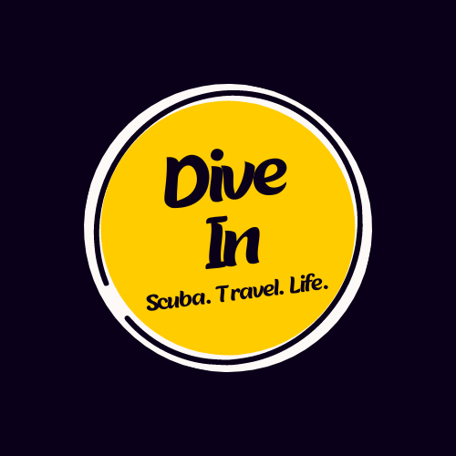

# Dive In

Dive In is a blog based on scuba diving, travel, and the lifestyle that comes with it. Users can view blogs, comment, share and add to the conversation.



## Table of Contents

...


# Project Name

A brief description of your project.

## Table of Contents

- [Project Overview](#project-overview)
- [Features](#features)
- [Installation](#installation)
- [Usage](#usage)
- [Testing](#testing)
- [Contributing](#contributing)
- [License](#license)

## Project Overview

Provide an overview of your project, explaining its purpose and goals. Include any relevant background information.

## Features

List the key features of your Django blog project. You can use bullet points or a table to present the features.

| Feature | Description |
|---------|-------------|
| Feature 1 | Description of feature 1 |
| Feature 2 | Description of feature 2 |
| Feature 3 | Description of feature 3 |

## Installation

Provide step-by-step instructions on how to install and set up your Django blog project. Include any dependencies or prerequisites that need to be installed.

1. Step 1
2. Step 2
3. Step 3

## Usage

Explain how to use your Django blog project. Provide examples and code snippets if necessary. Include any configuration options or settings that need to be modified.

# Project Planning

With a major time constraint in getting the project together, by using the MoSCoW method, I could prioritize the project requirements, focus on the must-haves and should-haves to deliver key functionalities, and then consider the could-haves based on available resources and time.

## Must-haves:

* User authentication and authorization for logging in, creating posts, and comments.
* Database models for blog posts, comments, and travel-related content.
* Basic UI for displaying blog posts, travel content, and user profiles.

## Should-haves:

* Enhanced user profile management with additional information such as profile picture, bio, etc.
* HTML/CSS styling for the UI to improve the overall look and feel.
* Comment moderation functionality to manage and moderate user comments.

## Could-haves:

* Rich text editing for creating and editing blog posts.
* Integration with a third-party API for fetching travel-related information or images.
* User notification system for new comments, likes, etc.

## Won't-haves:

* Advanced features like real-time chat functionality.
* Social media integration for sharing blog posts or travel content.
* Implementing a comprehensive search functionality.
```bash

## Project Planning
